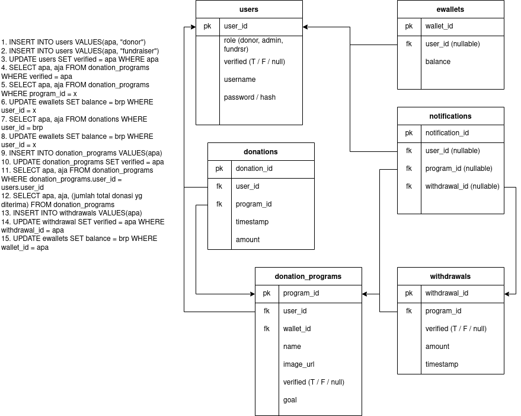

# Backend
Backend for final project of team KamiBisa

- [Backend](#backend)
  - [Usage](#usage)
  - [Documentation](#documentation)
    - [Data Model](#data-model)
    - [Requirements](#requirements)
    - [API Specification](#api-specification)
## Usage

`npm run db-init`: initializes db for use

`npm run start`: starts the server without initializing db \
`npm run dev`: starts the server without initializing db and refreshes on file changes

`npm run test`: initializes db and run jest tests

## Documentation

### Data Model

The database ERD is as follows

### Requirements

Basic and additional requirements are fulfilled through API calls as described in [requirements.md](docs/requirements.md)

### API Specification

APIs start with `/api` path, and are distributed into categories based on their database tables
- authentication
- ewallet
- notification
- donation_program
- donation
- verification
- withdrawal

Each endpoint is prefixed with the required method to use it. So for example the register API is at `/api/authentication/postRegister` and uses POST method

Examples on how to use each API is available at [api-examples.md](docs/api-examples.md)
